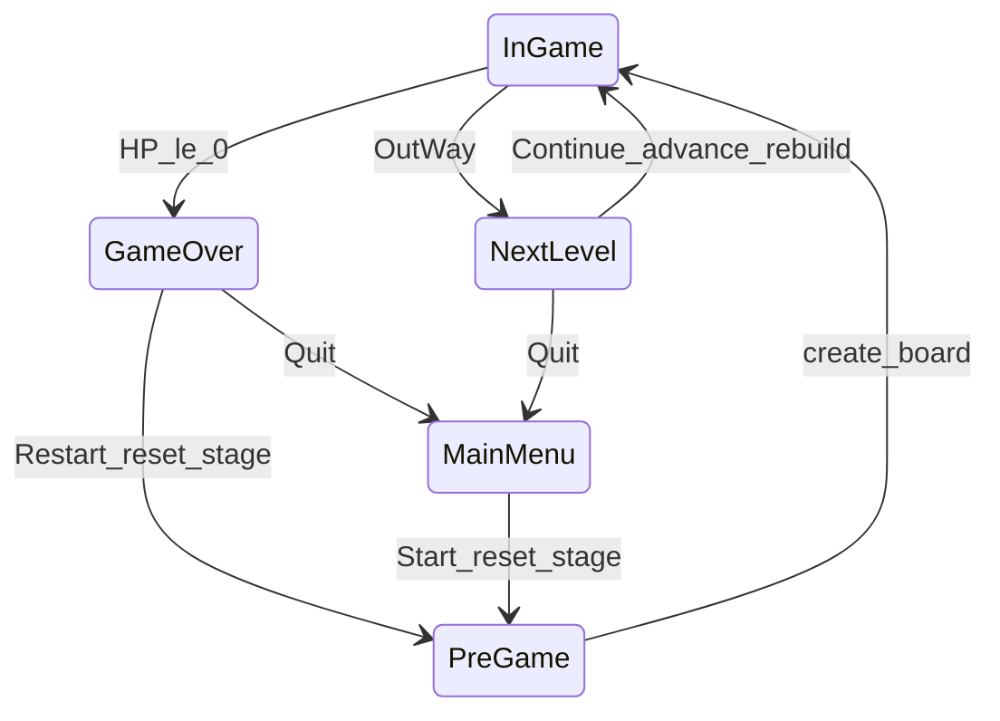

# 2025-05-16 设计与实现变更记录

本文档汇总本会话中对 `dungeons_sweeper` / `dungeons_plugin` 的主要设计与代码改动，便于后续查阅与继续迭代。

---

## 1. 玩家配置与地板效果（PlayerOptions）

### 1.1 动机

玩家属性原先在 `player_bundle` 中写死；安全点、宝藏、草地、出口等行为分散或未实现。需要单一数据源，并与难度公式、HUD 一致。

### 1.2 新增资源

| 资源 | 文件 | 说明 |
|------|------|------|
| `PlayerOptions` | `dungeons_plugin/src/resources/player_options.rs` | 生命上限/初始攻防、草地/安全点回复量、宝藏加攻 |
| `DifficultyTuning` | 同上 | 敌方总血量预算系数（`treasure_atk_fraction`、`survive_eta`、`avg_hits_per_monster`） |

默认值（开发期）示例：`max_hp=100`，`starting_damage=5`，`safe_heal_per_trigger=10`，`treasure_damage_bonus=1`，`grass_heal_per_trigger=1`。

### 1.3 玩家实体

- [`dungeons_plugin/src/bundles/player.rs`](dungeons_plugin/src/bundles/player.rs)：`player_bundle(opts: &PlayerOptions)`，从选项初始化 `Health` / `Damage` / `Defense`。
- `setup_board_options` 中 `insert_resource(PlayerOptions::default())` 与 `DifficultyTuning::default()`。

### 1.4 地板触发（`taggle_consumer`）

| 组件 | 行为 |
|------|------|
| `Safe` | 按 `safe_heal_per_trigger` 回血，不超过 `max_hp` |
| `Treasure` | `Damage` 饱和增加 `treasure_damage_bonus` |
| `OutWay` | 进入 `AppState::NextLevel`（见第 3 节），不再立即重建棋盘 |
| `Grass` | 经效果系统 `GrassHealPlayer`，上限来自 `TileEffectContext::player_hp_cap`（调度时写入 `PlayerOptions.max_hp`） |

草地 Bundle：[`grass_tile.rs`](dungeons_plugin/src/bundles/grass_tile.rs) 传入 `grass_heal`；[`effects/builtin.rs`](dungeons_plugin/src/effects/builtin.rs) 使用 `player_hp_cap` 封顶。

### 1.5 HUD

[`ui/plugins/hud/interaction.rs`](dungeons_plugin/src/ui/plugins/hud/interaction.rs) 血条分母改为 `PlayerOptions.max_hp`（不再硬编码 `PLAYER_HP_MAX`）。

---

## 2. 敌方单位与临近格显示

### 2.1 去掉敌方护盾

- 敌方 bundle 不再挂载 `Defense`；战斗只扣敌方 `Health`（[`taggle_consumer`](dungeons_plugin/src/observers/taggle_consumer.rs)）。

### 2.2 临近敌方格（EnemyNeighbor）

- 显示值为 **8 邻格内敌方实体当前 HP 之和**（非怪物数量）。
- 逻辑：`Board::adjacent_enemy_hp_sum_from_entities`（[`board.rs`](dungeons_plugin/src/resources/board.rs)）。
- 击杀后替换为 `EnemyNeighbor` 并刷新周围邻格数字；`Tile::EnemyNeighbor(u16)` 存 HP 和。

### 2.3 Bevy 查询冲突（B0001）

`taggle_consumer` 中敌方 `Health` 与玩家 `Health` 不能作为两个独立 `Query`，已合并为同一 `ParamSet`：

- `p0()`：`Query<&mut Health, With<Enemy>>`
- `p1()`：`Query<&Health, With<Enemy>>`
- `p2()`：`Query<(&mut Health, &mut Damage, &mut GoldCoin), With<Player>>`

---

## 3. 难度预算与关卡阶段

### 3.1 敌方生成（`difficulty_balance.rs`）

1. **档位上限**：`max_enemy_discriminant_index(stage) = (2 + stage).min(14)`，在弱档间加权随机。
2. **总血量预算**：放置怪物后调用 `balance_enemy_loadout`，在「击杀预算」与「生存预算」取较小值，超标则随机降级 `EnemyType`。
3. **`EnemyType`**：新增 `VARIANT_COUNT`、`from_discriminant_index` / `discriminant_index`。

### 3.2 关卡系数（随 stage 提升）

`apply_stage_to_board_option` 会写入：

- `difficulty_factor = 1.0 + 0.18 * (stage - 1)` → 影响 `EnemyType::health/damage`。
- 怪物/宝藏/安全点/出口数量：`counts_for_stage(area, stage)`（面积越大数量越多）。

### 3.3 棋盘尺寸阶梯扩大（本会话后期补充）

[`board_counts.rs`](dungeons_plugin/src/resources/board_counts.rs) 新增：

- `map_side_for_stage(stage)`：边长随关卡分段增大（如 stage 1 → 5×5，逐步至上限 15×15）。
- `map_size_for_stage(stage)` → `(side, side)`。
- **`apply_stage_to_board_option` 先设置 `board.map_size`，再算怪物数量**，保证 `TileMap` 与难度公式使用新面积。

---

## 4. 应用状态与流程

### 4.1 `AppState` 扩展

```text
Init → MainMenu → PreGame → InGame
                    ↑         ↓
              GameOver    GamePause（Esc）
                    ↑         ↓
              (Restart)   NextLevel（踩出口）
```

- 新增 **`NextLevel`**：与暂停分离；踩出口不再进 `GamePause` + 帧末重建。
- **`GameOver`**：HP ≤ 0 时由 [`player_action`](dungeons_plugin/src/observers/player_action.rs) 切换。

### 4.2 移除 `PendingBoardRebuild`

- 删除 `resources/pending_board_rebuild.rs` 及 `flush_pending_board_rebuild`。
- 升关重建改由 **Next Level 菜单 Continue** 调用 `advance_stage_and_rebuild_board`（[`lib.rs`](dungeons_plugin/src/lib.rs)）。

### 4.3 `advance_stage_and_rebuild_board`

```text
stage.advance()
→ apply_stage_to_board_option（含 map_size + 计数 + difficulty_factor）
→ rebuild_board_entities（清 WorldEffectHost、旧 Board、生成新 TileMap 与实体）
```

PreGame 的 `create_board` 与 Continue 共用 `rebuild_board_entities`，但不升关。

### 4.4 棋盘生命周期

- `setup_player`：仅当世界无 `Player` 实体时再 `spawn`（避免重复 `Single<Player>`）。
- `rebuild_board_entities`：PreGame / Continue 共用。

---

## 5. UI：Game Over 与 Next Level

结构对齐 [`pause_menu`](dungeons_plugin/src/ui/plugins/pause_menu/)（`components` / `layout` / `interaction` / `mod`）。

### 5.1 Game Over（`ui/plugins/game_over_menu/`）

| 时机 | 行为 |
|------|------|
| `OnEnter(GameOver)` | 生成全屏菜单，显示当前 `GoldCoin` / `Gem` |
| **Restart** | `stage.reset_to_first_stage()` → 清 Board → despawn 玩家 → `PreGame` |
| **Quit to Main Menu** | 清 Board、复位相机 → `MainMenu` |

### 5.2 Next Level（`ui/plugins/next_level/`）

| 时机 | 行为 |
|------|------|
| `OnEnter(NextLevel)` | 「关卡完成」+ Continue / Quit |
| **Continue** | `advance_stage_and_rebuild_board` → `InGame` |
| **Quit to Main Menu** | 清 Board、不升关 → `MainMenu` |

### 5.3 HUD 过渡（`HudPlugin`）

| 过渡 | 系统 |
|------|------|
| `PreGame → InGame` | `spawn_hud` |
| `InGame → GameOver` / `InGame → NextLevel` | `despawn_hud` |
| `NextLevel → InGame` | `spawn_hud`（Continue 不经过 PreGame） |

`GameUIPlugin` 注册：`MainMenuPlugin`、`GameOverMenuPlugin`、`PauseMenuPlugin`、`NextLevelPlugin`、`HudPlugin`。

---

## 6. 问题排查与修复记录

### 6.1 Game Over → Restart 未回到第 1 关

**原因**：主菜单「开始游戏」会 `stage.reset_to_first_stage()`，Game Over / 暂停 Restart 原先只进 `PreGame`，`StageConfig.stage` 仍为死亡时关卡。

**修复**：

- [`game_over_menu/interaction.rs`](dungeons_plugin/src/ui/plugins/game_over_menu/interaction.rs) Restart 前 `stage.reset_to_first_stage()`。
- [`pause_menu/mod.rs`](dungeons_plugin/src/ui/plugins/pause_menu/mod.rs) `restart_game` 同样重置。

### 6.2 运行时「地板中心底部橙色图块」

**结论**（Ask 模式分析，未改色）：

- 橙红色来自 [`enemy_tile.rs`](dungeons_plugin/src/bundles/enemy_tile.rs)：`Color::linear_rgb(0.95, 0.24, 0.12)`。
- 棋盘坐标 `(约 width/2, y=0)` 对应世界坐标底边正中；该格若为敌方且白盖已揭开，会固定看到橙色底。
- **出生点**（`spawn_tile`）为青绿色且无 `cover`，与橙色不同。

---

## 7. 主要涉及文件索引

| 模块 | 文件 |
|------|------|
| 插件入口 / 状态 / 重建 | `dungeons_plugin/src/lib.rs` |
| 玩家选项 | `dungeons_plugin/src/resources/player_options.rs` |
| 关卡计数与地图边长 | `dungeons_plugin/src/resources/board_counts.rs` |
| 难度预算 | `dungeons_plugin/src/resources/difficulty_balance.rs` |
| 地图生成 | `dungeons_plugin/src/resources/tile_map.rs` |
| 点击逻辑 | `dungeons_plugin/src/observers/taggle_consumer.rs` |
| 受伤 / 死亡 | `dungeons_plugin/src/observers/player_action.rs` |
| 效果调度 | `dungeons_plugin/src/effects/dispatch.rs`, `context.rs`, `builtin.rs` |
| Game Over UI | `dungeons_plugin/src/ui/plugins/game_over_menu/*` |
| Next Level UI | `dungeons_plugin/src/ui/plugins/next_level/*` |
| HUD | `dungeons_plugin/src/ui/plugins/hud/mod.rs`, `interaction.rs` |

---

## 8. 数据流简图



---

## 9. 后续可选项（未实现）

- 玩家无 `Defense` 时受伤路径是否应直接扣血（当前主要在护盾耗尽后扣血）。
- Game Over Restart 是否重置 `EffectCounters` 等局内计数。
- 出生点 `Spawn` 是否也应加 `cover`，与草地一致。
- 敌方格橙色底板是否改为更弱对比色或仅保留 Atlas 精灵。

---

*文档生成自 2025-05-16 开发会话总结。*
