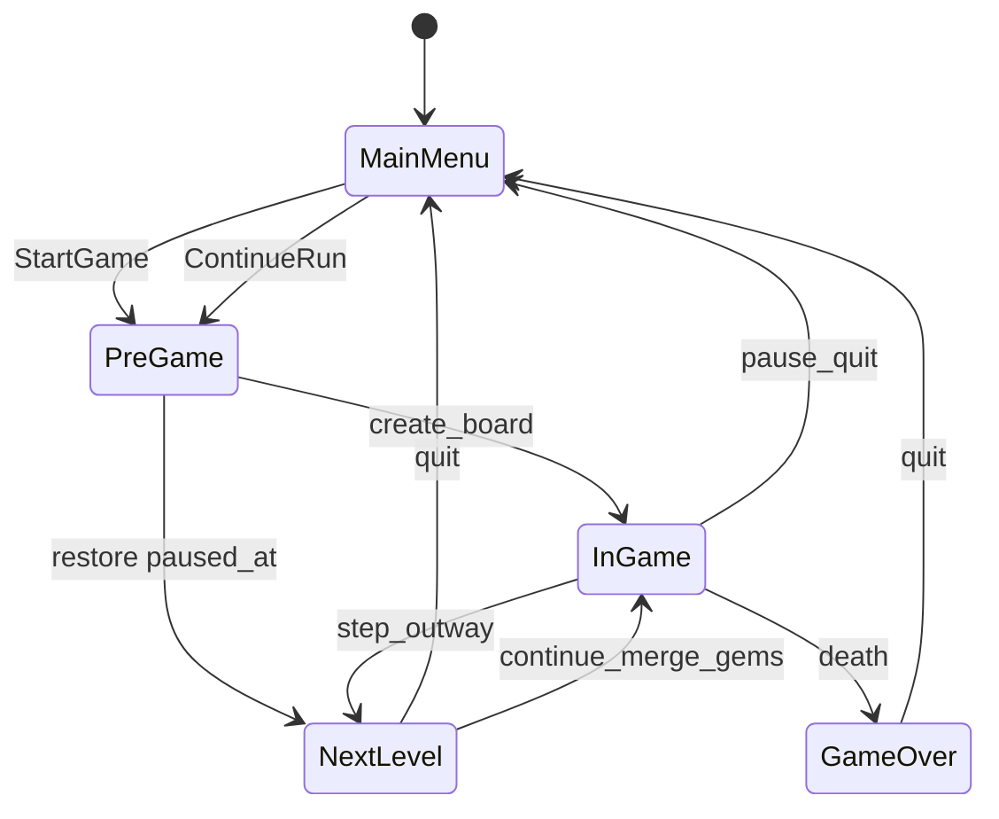

# 存档系统设计

本文档描述 `dungeons_sweeper` 的双层持久化方案，与 [5-16-design.md](./5-16-design.md) 中的 `AppState`、棋盘重建、玩家组件设计衔接。

---

## 1. 目标

| 存档类型 | 文件 | 内容 | 写入时机 | 读取时机 |
|----------|------|------|----------|----------|
| **全局存档** | `global_save.ron` | 累计宝石 `gems` | Continue 升关合并后 | 启动 |
| **局内存档** | `run_save.ron` | 关卡、棋盘逻辑、玩家状态 | 从局内返回主菜单 | 主菜单「继续」 |

**不在全局合并**：局内金币 `GoldCoin` 仅用于单局 HUD/玩法。

**宝石合并**：下一关菜单点击 Continue、调用 `advance_stage_and_rebuild_board` **之前**，`global_gems += player_gems`，玩家 `Gem` 清零并写全局档。

---

## 2. 路径与格式

- 目录：`{data_local_dir}/dungeons_sweeper/`（`dirs` crate）
- 格式：RON + `serde`
- 版本字段：`version: 1`；不匹配时局存档拒绝加载并打 log

---

## 3. 数据 Schema

### 3.1 `GlobalSave`

```ron
(
    version: 1,
    gems: 42,
)
```

### 3.2 `RunSave`

```ron
(
    version: 1,
    stage: 2,
    paused_at: InGame,  // 或 NextLevel
    view: Some((0.0, 0.0, 0.0)),
    board: ( /* BoardSnapshot */ ),
    player: ( /* PlayerSnapshot */ ),
)
```

- **BoardSnapshot**：`map_size`、`difficulty_factor`、各计数、`tiles` 二维网格、`uncovered` 已揭盖坐标、`enemy_hp` 仍存活敌方当前 HP
- **PlayerSnapshot**：`health`、`damage`、`defense`、`gold`、`gems`

完整网格必选：击杀后格变为 `EnemyNeighbor`、实体 despawn，无法仅靠 `stage` 种子复现。

### 3.3 运行时

- **GlobalProfile** 实体：`GlobalProfile` marker + `Gem(u32)`，启动时与磁盘同步
- **PendingRunRestore**：`Option<RunSave>`，主菜单 Continue 注入，`PreGame` 消费后清空
- **RunSaveAvailable**：`bool`，供主菜单 Continue 按钮启用

---

## 4. 状态与流程



### 写局内存档

`OnTransition` → `MainMenu`，且 `exited` ∈ `{ InGame, GamePause, NextLevel }`：`capture_run_snapshot` + `write_run_save`。

**不写**：`GameOver → MainMenu`（进入 Game Over 时删除局存档）。

### 删局内存档

- 进入 `GameOver`
- 主菜单 Start Game、Game Over Restart、Pause Restart

### 读局内存档

Continue → `load_run_save` → `PendingRunRestore` → `PreGame` → 跳过 `apply_stage_to_board_option`，用 snapshot 填 `StageConfig` / `BoardOption` → `rebuild_board_from_snapshot` → `InGame` 或 `NextLevel`。

---

## 5. 棋盘重建

| 函数 | 用途 |
|------|------|
| `rebuild_board_procedural` | 新游戏 / Continue 升关（`TileMap::set_additem`） |
| `rebuild_board_from_snapshot` | 读档：从 `BoardSnapshot` 构造 `TileMap` + `spawn_tiles` |
| `apply_board_restoration` | 揭盖 `Uncover`/`Exposed`、覆盖敌方 `Health` |

`Handle<Font>` 不序列化；读档使用当前 `BoardOption.counter_font`。

---

## 6. UI

- **主菜单**：显示 `GlobalProfile` 的宝石数；`ContinueRunButton` 依 `RunSaveAvailable` 启用
- **HUD / Game Over**：仍显示玩家局内 `GoldCoin` / `Gem`

---

## 7. 宝石获取扩展点（未实现）

在以下位置增加 `player_gem += n` 即可与金币对称：

- 宝藏格触发（`taggle_consumer` / `Treasure`）
- 关卡奖励、成就回调
- 调试作弊指令

合并逻辑无需改动。

---

## 8. 已知限制

- `EffectCounters` 读档后重置为默认
- 无多槽位、无云同步、无进程退出自动写盘（仅回主菜单写局存档）
- 局存档版本不兼容时静默禁用 Continue

---

## 9. 代码索引

| 模块 | 路径 |
|------|------|
| SavePlugin | `dungeons_plugin/src/save/` |
| 棋盘分支 | `dungeons_plugin/src/lib.rs` |
| 主菜单 | `dungeons_plugin/src/ui/plugins/main_menu/` |
| Continue 合并宝石 | `dungeons_plugin/src/ui/plugins/next_level/interaction.rs` |
